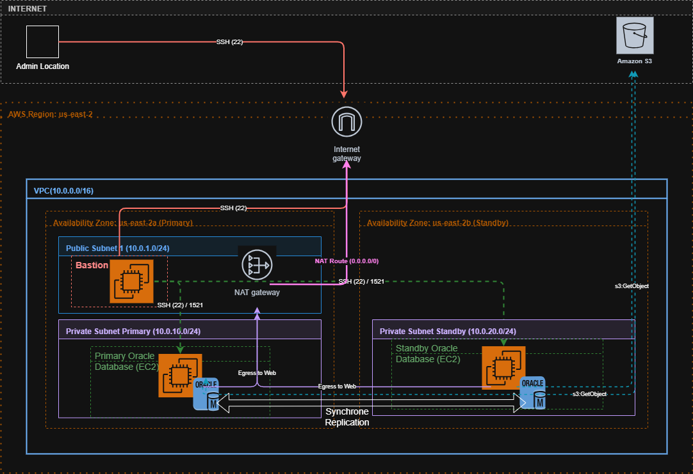

# Oracle HA Platform on AWS

Oracle HA Platform on AWS is a project demonstrating the automated deployment of an Oracle High Availability platform on AWS using Oracle Data Guard.

## Description

The project leverages:

Terraform for Infrastructure as Code,
Ansible for automation and configuration management,
Oracle Database with Oracle Data Guard for high availability.

The objective is to build a modern cloud-based Oracle platform featuring:

bastion architecture and private subnets,
full Oracle lifecycle automation,
Platform DBA / Cloud DBA engineering practices.

The project demonstrates:

AWS infrastructure automation with Terraform
Oracle Database 19c deployment automation with Ansible
Bastion-based private subnet architecture
Oracle Data Guard High Availability
Oracle Data Guard Broker
Infrastructure-as-Code and DBA automation practices

The goal of the project is to simulate a production-style Oracle HA environment while developing Cloud DBA / Platform DBA skills.

# Architecture



## Getting Started

### Dependencies

*Before deploying the platform, ensure the following prerequisites are available:

An AWS account
You can use an AWS Free Tier account for testing and lab purposes.
A DynamoDB table
Used for Terraform state locking and centralized state management.
An Amazon S3 bucket
Used to:
store the terraform.tfstate file,
host the Oracle installation binaries required for deployment.
Local tools installation
The following tools must be installed on your workstation:
Terraform
Ansible
AWS Command Line Interface
Visual Studio Code
An AWS SSH key pair
Required to access the bastion host and private instances through Ansible and SSH ProxyJump.

### Installing & Executing program

1. Clone the Repository
git clone https://github.com/Saad7478/oracle-ha-platform-aws.git
cd oracle-ha-platform-aws

2. Configure AWS CLI

Configure your AWS credentials locally:

```bash
aws configure
```
Provide:

AWS Access Key
AWS Secret Key
Default region
Output format

3. Configure Terraform Backend

update : oracle-ha-platform-aws/terraform/environments/dev/main.tf

Example:

```yaml
terraform {
  backend "s3" {
    bucket         = "my-terraform-statexxx"
    key            = "oracleDG/dev/terraform.tfstate"
    region         = "us-east-2"
    dynamodb_table = "terraform-locks"
    profile = "aws2"
  }
}
```

update : oracle-ha-platform-aws/terraform/environments/dev/terraform.tfvars
example :

cidr = "10.0.0.0/16"

public_azs = [
  "us-east-2a",
  "us-east-2b"
]

primary_azs = [
  "us-east-2a"
]

standby_azs = [
  "us-east-2b"
]

public_subnets = [
  "10.0.1.0/24"
]

private_primary = [
  "10.0.10.0/24"
]

private_standby = [
  "10.0.20.0/24"
]

4. Upload Oracle 19c Binaries to S3

Upload the Oracle installation ZIP files to your S3 bucket.

Example:

```bash
aws s3 cp LINUX.X64_193000_db_home.zip s3://your-oracle-binaries-bucket/
```

5. Initialize Terraform

```bash
cd terraform/environments/dev
terraform init
```

6. Review Infrastructure Plan

```bash
terraform plan
```

7. Deploy AWS Infrastructure

```bash
terraform apply
```

The deployment creates:

VPC
Public and private subnets
Security groups
EC2 Bastion host
EC2 Primary Oracle server
EC2 Standby Oracle server
Nat Gateway
Internet Gateway
IAM Role
Route tables
Elastic IP

8. Generate Ansible Inventory

Terraform automatically generates the Ansible inventory file using Terraform outputs.

Example generated inventory:

[bastion]
bastion_ec2 ansible_host=3.151.185.42 ec2_instance_id=i-0b9561c507c893b90

[primary]
primary_db ansible_host=10.0.10.113 ec2_instance_id=i-08b444b7fa62brc40

[standby]
standby_db ansible_host=10.0.20.137 ec2_instance_id=i-01bdcc4c64cd61a35

[oracle_servers:children]
primary
standby

[oracle_servers:vars]
ansible_ssh_common_args='-o ProxyJump=rocky@3.151.184.42 -o ForwardAgent=yes'

9. Configure SSH Access

Update your local SSH configuration:

~/.ssh/config

Example:

Host bastion
    HostName 3.151.185.42
    User rocky
    IdentityFile ~/.ssh/aws-oracle-lab
    ForwardAgent yes
    StrictHostKeyChecking no
    UserKnownHostsFile /dev/null

Host primary
    HostName 10.0.10.113
    User rocky
    IdentityFile ~/.ssh/aws-oracle-lab
    ProxyJump bastion
    StrictHostKeyChecking no
    UserKnownHostsFile /dev/null

Host standby
    HostName 10.0.20.137
    User rocky
    IdentityFile ~/.ssh/aws-oracle-lab
    ProxyJump bastion
    StrictHostKeyChecking no
    UserKnownHostsFile /dev/null


10. Test Connectivity
ssh primary

ssh standby

11. Create ansible vault
ansible-vault create playbooks/group_vars/vault.yaml
New Vault password:
Confirm New Vault password:

vault_sys_password: Oracle#123
vault_system_password: Oracle#123
vault_pdbadmin_password: Oracle#123

echo "oracle" > .vault_pass
chmod 600 .vault_pass

12. Start SSH agent and add AWS Oracle lab key
eval "$(ssh-agent -s)"
ssh-add ~/.ssh/aws-oracle-lab

13. Run Ansible Playbooks
ansible-playbook playbooks/site.yaml --vault-password-file .vault_pass

This command executes the following playbooks:

Oracle prerequisites : oracle_prereqs.yml
Oracle software installation : oracle_install.yml
Database creation : oracle_db_creation.yaml
Enable ARCHIVELOG : oracle_archivelog.yaml
Configure Data Guard : oracle_dataguard_prepare.yaml
Create standby database : oracle_dataguard_standby.yml
Validate Data Guard : oracle_dataguard_verify.yaml
Configure Data Guard Broker : oracle_dataguard_broker.yml


12. Validate Oracle Data Guard

Connect to the primary database:

sqlplus / as sysdba

Validation examples:

select database_role from v$database;

select process,status from v$managed_standby;

Broker validation:

dgmgrl sys/password
show configuration;

Expected result:

SUCCESS

## Help

Any advise for common problems or issues.
```
command to run if program contains helper info
```

## Authors

Contributors names and contact info

Saad BRAHMIA  
https://www.linkedin.com/in/saad-brahmia-48109430/

## Version History

* 0.1
    * Initial Release

## License

This project is free to use and distribute.

## Acknowledgments

